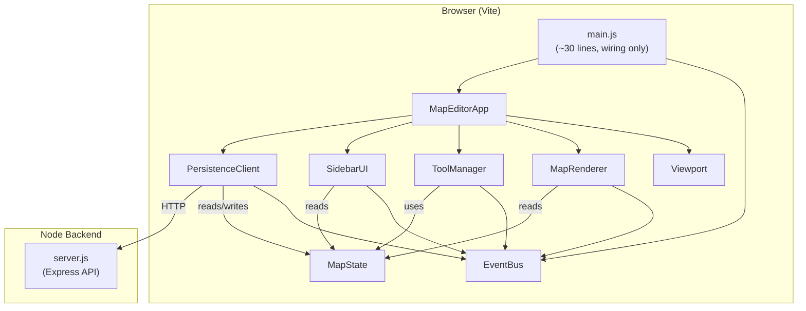

# Map Maker — Architecture & Implementation Plan

## Problem Statement

The current Map Maker has **all interaction logic in a single 368-line [main.js](file:///c:/Users/lauri/Documents/Repos/random-stuff/pet-protector/map-maker/src/main.js)** file. This file handles tool selection, DOM manipulation, entity management, painting, persistence, and event handling with tight coupling to PixiJS internals, the DOM, and the backend API. The result is fragile code where a single broken line crashes the entire app, and every change requires touching [main.js](file:///c:/Users/lauri/Documents/Repos/random-stuff/pet-protector/map-maker/src/main.js).

This plan proposes a clean, modular rewrite with dedicated modules, clear boundaries, and unit tests for each layer. All existing code is considered disposable.

> [!IMPORTANT]
> **Nothing is marked as "done" here.** Every module must be implemented, tested, and **verified in the browser** before being checked off. The browser test is the final gate—not the code review.

---

## Tile Data Model

Each tile is a **layered struct** — like 2D Pokemon, you place terrain, then furniture/trees, then pickups on top. Tools operate on **one layer at a time**.

```js
{ base: 'grass_v1', decoration: 'tree_oak', pickup: 'apple', zone: null, warp: null }
```

| Layer | Purpose | Example values |
|-------|---------|----------------|
| `base` | Ground terrain — always present | `'grass_v1'`, `'dirt_path'`, `'water_shallow'` |
| `decoration` | Permanent objects on top of terrain | `'tree_oak'`, `'table_wood'`, `'rock_large'`, `null` |
| `pickup` | Interactive/consumable items | `'apple'`, `'fish'`, `'key_gold'`, `null` |
| `zone` | Behavioral overlay (invisible in-game) | `'safe_zone'`, `'battle_zone'`, `null` |
| `warp` | Transition point ID (links to manifest) | `'warp_12345'`, `null` |

New chunks default to **empty** (all layers `null`, `base: 'empty'`) until painted.

> [!NOTE]
> **Future evolution:** `decoration` will become an array of `{ id, offsetX, offsetY }` to support multiple objects per tile (e.g., table + lamp + flowers). This is noted in the roadmap but not implemented in the MVP.

### Data-Driven Tile Definitions

Ground tiles are defined in [tile_defs.json](file:///c:/Users/lauri/Documents/Repos/random-stuff/pet-protector/map-maker/src/data/tile_defs.json), not hardcoded. This enables:
- Adding new terrain types without touching code.
- **Tileset theming** — tile IDs (e.g., `grass`) are abstract; a theme file maps them to specific sprites/colors. One map definition, multiple visual styles.

```js
// tile_defs.json
{
  "grass_v1": { "name": "Grass", "category": "natural", "walkable": true },
  "water_shallow": { "name": "Shallow Water", "category": "water", "walkable": false },
  "dirt_path": { "name": "Dirt Path", "category": "path", "walkable": true }
}
```

The **color mapping** in [TileColors.js](file:///c:/Users/lauri/Documents/Repos/random-stuff/pet-protector/map-maker/src/rendering/TileColors.js) acts as the default "dev theme". Future tileset support swaps this for sprite lookups.

---

## Architecture Overview



### Key Principles

1. **[main.js](file:///c:/Users/lauri/Documents/Repos/random-stuff/pet-protector/map-maker/src/main.js) is glue only** — creates instances, wires subscribers, starts the loop. ~30 lines.
2. **EventBus decouples everything** — modules communicate via named events, never direct references.
3. **MapState is the single source of truth** — all data lives here; it's just data, no DOM/PIXI knowledge.
4. **ToolManager owns all input** — mouse/keyboard handlers live in one place, dispatch to the active tool strategy.
5. **MapRenderer is a pure read-only view** — subscribes to `state:changed`, re-renders. No business logic.
6. **SidebarUI manages the DOM** — palettes, property editor, entity list. Emits events when user selects things.
7. **PersistenceClient is the HTTP layer** — auto-save timer, manual save, load. Talks to the server.

---

## Directory Structure

```
map-maker/
├── CONTRIBUTING.md                  # [NEW] Extensibility guide for future sessions
├── index.html                      # Shell HTML (sidebar skeleton + viewport div)
├── src/
│   ├── main.js                     # [REWRITE] ~30 lines of wiring
│   ├── style.css                   # [REWRITE] Clean dark-theme stylesheet
│   ├── core/
│   │   ├── EventBus.js             # [NEW] Pub/sub event system
│   │   ├── MapState.js             # [REWRITE] Data model (chunks, manifest, dirty flags)
│   │   ├── ActionHistory.js        # [REWRITE] Command pattern (extracted from Actions.js)
│   │   ├── Actions.js              # [REWRITE] PaintTileAction, PlaceEntityAction, etc.
│   │   ├── TileDefs.js             # [NEW] Data-driven tile definitions (loads tile_defs.json)
│   │   └── ItemRegistry.js         # [REWRITE] Item/pickup definitions
│   ├── tools/
│   │   ├── ToolManager.js          # [NEW] Input handler + active tool dispatch
│   │   ├── BrushTool.js            # [NEW] Single-tile and drag painting
│   │   ├── EraseTool.js            # [NEW] Reset tile to default
│   │   ├── FillTool.js             # [NEW] Flood-fill algorithm
│   │   ├── SelectTool.js           # [NEW] Tile inspector + entity selection
│   │   ├── SpawnerTool.js          # [NEW] Place spawner entity
│   │   ├── WarpTool.js             # [NEW] Place warp entity
│   │   └── ZoneTool.js             # [NEW] Paint zone overlay
│   ├── rendering/
│   │   ├── MapRenderer.js          # [REWRITE] PixiJS v8 rendering (from Renderer.js)
│   │   ├── Viewport.js             # [REWRITE] Pan/zoom (keep mostly as-is)
│   │   └── TileColors.js           # [NEW] Color mapping extracted from Renderer
│   ├── ui/
│   │   ├── SidebarUI.js            # [NEW] All sidebar DOM management
│   │   ├── PropertyPanel.js        # [NEW] Entity property editor
│   │   └── StatusBar.js            # [NEW] Auto-save timer, version display
│   ├── persistence/
│   │   └── PersistenceClient.js    # [NEW] HTTP client for save/load/deploy
│   ├── data/
│   │   └── tile_defs.json          # [NEW] Ground tile definitions
│   └── server/
│       ├── server.js               # [KEEP] Express backend (working, tested)
│       └── server.test.js          # [KEEP] Existing passing tests
```

---

## Proposed Changes — Ordered by Dependency

### Phase 1: Foundation (no PIXI, no DOM — pure logic, fully testable)

---

#### [NEW] [EventBus.js](file:///c:/Users/lauri/Documents/Repos/random-stuff/pet-protector/map-maker/src/core/EventBus.js)

A minimal pub/sub system. Every module communicates through this.

```js
// API: bus.on(event, callback), bus.off(event, callback), bus.emit(event, data)
```

**Events emitted across the app:**

| Event | Payload | Emitted by |
|-------|---------|------------|
| `tool:changed` | `string` (tool name) | ToolPickerPanel, ShortcutManager — **request** to switch tool |
| `tool:active` | `string` (tool name) | ToolManager — **confirmation** after switch completes |
| `tile:selected` | `string` (tileId) | PalettePanel |
| `item:selected` | `string` (itemId) | PalettePanel |
| `state:changed` | `{ type, ... }` | MapState |
| `entity:selected` | entity object | EntityNavigator |
| `save:requested` | — | Toolbar, ShortcutManager |
| `save:completed` | `{ version, type: 'auto'\|'master' }` | PersistenceClient |
| `save:error` | `{ message }` | PersistenceClient |
| `map:created` | `{ name }` | PersistenceClient |
| `map:loaded` | `{ name }` | PersistenceClient |
| `map:renamed` | `{ oldName, newName }` | PersistenceClient |
| `viewport:snap` | `{ x, y }` | EntityNavigator |
| `cursor:moved` | `{ tx, ty }` | main.js (on mousemove) |
| `fill:error` | `{ message }` | FillTool |
| `tile:inspected` | `{ tx, ty, tileData, entities }` | SelectTool |
| `erase:layer-changed` | `string` (layer name) | PropertyPanel (erase picker) |
| `toast:show` | `{ message, type }` | Any panel — cross-cutting notification |

---

#### [REWRITE] [MapState.js](file:///c:/Users/lauri/Documents/Repos/random-stuff/pet-protector/map-maker/src/core/MapState.js)

Pure data model. No DOM, no PIXI, no HTTP. Takes an [EventBus](file:///c:/Users/lauri/Documents/Repos/random-stuff/pet-protector/map-maker/src/core/EventBus.js#1-23) in its constructor.

- Manages `chunks`, `manifest`, `dirty`, `needsRedraw` flags.
- Emits `state:changed` on every mutation.
- [getChunk(x, y)](file:///c:/Users/lauri/Documents/Repos/random-stuff/pet-protector/map-maker/src/core/MapState.js#39-47) creates chunks lazily.
- [setTileData(x, y, layer, value)](file:///c:/Users/lauri/Documents/Repos/random-stuff/pet-protector/map-maker/src/core/State.js#54-62) mutates and emits.
- [addEntity(type, data)](file:///c:/Users/lauri/Documents/Repos/random-stuff/pet-protector/map-maker/src/core/MapState.js#90-98), [removeEntity(type, id)](file:///c:/Users/lauri/Documents/Repos/random-stuff/pet-protector/map-maker/src/core/MapState.js#99-107) for manifest mutations.
- [serialize()](file:///c:/Users/lauri/Documents/Repos/random-stuff/pet-protector/map-maker/src/core/MapState.js#108-119) returns `{ mapName, manifest, chunks }` for saving.
- [deserialize(data)](file:///c:/Users/lauri/Documents/Repos/random-stuff/pet-protector/map-maker/src/core/MapState.js#120-135) loads from saved JSON.

---

#### [REWRITE] [ActionHistory.js](file:///c:/Users/lauri/Documents/Repos/random-stuff/pet-protector/map-maker/src/core/ActionHistory.js)

Extracted from current [Actions.js](file:///c:/Users/lauri/Documents/Repos/random-stuff/pet-protector/map-maker/src/core/Actions.js). Pure undo/redo stack.

---

#### [REWRITE] [Actions.js](file:///c:/Users/lauri/Documents/Repos/random-stuff/pet-protector/map-maker/src/core/Actions.js)

Action classes — each has `execute(state)` and `undo(state)`:

- `PaintTileAction(x, y, layer, newValue, oldValue)` — single tile mutation
- `BatchPaintAction(paints[])` — multiple tile mutations as **one undo step**. Use this for any operation affecting more than one tile (e.g. flood fill). `paints` is `Array<{ x, y, layer, newValue, oldValue }>`. Undo iterates in reverse.
- `PlaceEntityAction(type, data)` — adds to manifest[type]
- `RemoveEntityAction(type, data)` — removes from manifest[type]

---

#### [NEW] [TileDefs.js](file:///c:/Users/lauri/Documents/Repos/random-stuff/pet-protector/map-maker/src/core/TileDefs.js)

Loads [tile_defs.json](file:///c:/Users/lauri/Documents/Repos/random-stuff/pet-protector/map-maker/src/data/tile_defs.json). Provides [getTile(id)](file:///c:/Users/lauri/Documents/Repos/random-stuff/pet-protector/map-maker/src/core/TileDefs.js#9-12), [getAllTiles()](file:///c:/Users/lauri/Documents/Repos/random-stuff/pet-protector/map-maker/src/core/TileDefs.js#13-16), [getTilesByCategory()](file:///c:/Users/lauri/Documents/Repos/random-stuff/pet-protector/map-maker/src/core/TileDefs.js#17-20). Used by SidebarUI to populate the ground palette and by TileColors for rendering.

---

#### [REWRITE] [ItemRegistry.js](file:///c:/Users/lauri/Documents/Repos/random-stuff/pet-protector/map-maker/src/core/ItemRegistry.js)

Rename of [Items.js](file:///c:/Users/lauri/Documents/Repos/random-stuff/pet-protector/map-maker/src/core/Items.js). Now covers both **decorations** and **pickups** as separate categories.

---

### Phase 2: Tools (no DOM, no PIXI — interact only with MapState)

---

#### [NEW] [ShortcutManager.js](file:///c:/Users/lauri/Documents/Repos/random-stuff/pet-protector/map-maker/src/core/ShortcutManager.js)

Central keyboard shortcut registry. Replaces the hardcoded `keydown` block that was in `main.js`.

- `register({ key, ctrlKey, shiftKey, action, description })` — throws on duplicate canonical key.
- `registerCoreShortcuts(state, bus)` — registers Ctrl+Z (undo), Ctrl+Shift+Z (redo), Ctrl+S (save).
- `registerToolShortcuts(toolManager)` — walks `toolManager.tools`, reads each tool's `static shortcut`, registers it. Throws if any tool has `shortcut = null` (forgot to declare). Skips `''` (intentionally no shortcut).
- `handleEvent(e)` — pure dispatch, no DOM coupling. Called by the listener and directly in tests.
- `attach(target)` / `detach(target)` — bind/unbind the `keydown` listener.
- Case is NOT normalised — `'z'` (zone tool) and `'Z'` (Ctrl+Shift+Z redo) are distinct canonicals.

**Tool shortcut convention:** Every `Tool` subclass must declare `static shortcut`. Three valid values:
- `null` — forgot to declare → completeness test throws at startup
- `''` — intentionally no shortcut → skipped silently
- `'b'` etc. — registered as a key binding

---

#### [NEW] [ToolManager.js](file:///c:/Users/lauri/Documents/Repos/random-stuff/pet-protector/map-maker/src/tools/ToolManager.js)

- Constructor: `ToolManager(bus, state, tileDefs = null)`. `tileDefs` is passed to `WarpTool` for walkability checks.
- Owns the `activeTool` reference.
- `setTool(name)` — emits `tool:active` after switching (this is the confirmation; `tool:changed` is the request).
- `onPointerDown(tx, ty)`, `onPointerMove(tx, ty)`, `onPointerUp()` — delegate to the active tool.
- `registerShortcuts(shortcutManager)` — delegates to `shortcutManager.registerToolShortcuts(this)`.
- Subscribes to `tile:selected` to configure brush + fill (does NOT auto-switch tool).
- Subscribes to `item:selected` to configure brush (does NOT auto-switch tool).
- Subscribes to `erase:layer-changed` to configure erase tool's target layer.

---

#### [NEW] [BrushTool.js](file:///c:/Users/lauri/Documents/Repos/random-stuff/pet-protector/map-maker/src/tools/BrushTool.js)

- [onDown(tx, ty)](file:///c:/Users/lauri/Documents/Repos/random-stuff/pet-protector/map-maker/src/tools/EraseTool.js#5-8) — paints single tile via `state.applyAction(new PaintTileAction(...))`.
- [onMove(tx, ty)](file:///c:/Users/lauri/Documents/Repos/random-stuff/pet-protector/map-maker/src/tools/ZoneTool.js#16-19) — same (drag painting).
- Handles both `base` (ground) and `item` layers based on configuration.

---

#### [NEW] [SelectTool.js](file:///c:/Users/lauri/Documents/Repos/random-stuff/pet-protector/map-maker/src/tools/SelectTool.js)

Click a tile to inspect all layers and entities. Emits `tile:inspected` with `{ tx, ty, tileData, entities }`. Entity discovery is generic: scans all manifest arrays by (x, y) coordinate — new entity types are automatically included. Shortcut: `v`. Point-only (no drag).

---

#### [NEW] EraseTool.js, FillTool.js, SpawnerTool.js, WarpTool.js, ZoneTool.js

Each follows the same interface: [onDown](file:///c:/Users/lauri/Documents/Repos/random-stuff/pet-protector/map-maker/src/tools/EraseTool.js#5-8), [onMove](file:///c:/Users/lauri/Documents/Repos/random-stuff/pet-protector/map-maker/src/tools/ZoneTool.js#16-19), [onUp](file:///c:/Users/lauri/Documents/Repos/random-stuff/pet-protector/map-maker/src/tools/BrushTool.js#11-12).

**FillTool** uses a BFS flood-fill on matching `base` tiles. It **crosses chunk boundaries** transparently. A `MAX_FILL_TILES` limit (default: 10,000) prevents runaway fills — if exceeded, the fill aborts entirely (no partial changes) and emits `fill:error`. The entire fill is wrapped in a single `BatchPaintAction` so it undoes in one Ctrl+Z.

**WarpTool** takes `tileDefs` as an optional second constructor arg. If provided, placement is blocked on non-walkable tiles (water, rock) — a warp the player can never reach is useless. Silent no-op if the tile is non-walkable.

---

### Phase 3: Rendering (PIXI only, no DOM sidebar knowledge)

---

#### [REWRITE] [MapRenderer.js](file:///c:/Users/lauri/Documents/Repos/random-stuff/pet-protector/map-maker/src/rendering/MapRenderer.js)

- Uses **only** PixiJS v8 API (`rect`/`fill`/`stroke`, not `beginFill`/`drawRect`).
- Constructor takes [(container, bus)](file:///c:/Users/lauri/Documents/Repos/random-stuff/pet-protector/map-maker/src/core/EventBus.test.js#16-17). Calls `app.init()` in its own `async init()`.
- Subscribes to `state:changed` — sets a `_needsRedraw` flag.
- [update()](file:///c:/Users/lauri/Documents/Repos/random-stuff/pet-protector/map-maker/src/core/Renderer.js#29-35) method called each frame; only redraws when `_needsRedraw` is true.
- Converts mouse events to world coords and calls `toolManager.onPointerDown(worldX, worldY)`.

---

#### [NEW] [TileColors.js](file:///c:/Users/lauri/Documents/Repos/random-stuff/pet-protector/map-maker/src/rendering/TileColors.js)

Simple lookup: `getColor(tileId) → number`. Extracted from [_getBaseColor](file:///c:/Users/lauri/Documents/Repos/random-stuff/pet-protector/map-maker/src/core/Renderer.js#142-156).

---

#### [REWRITE] [Viewport.js](file:///c:/Users/lauri/Documents/Repos/random-stuff/pet-protector/map-maker/src/rendering/Viewport.js)

Mostly kept as-is. Takes `canvas` directly in [init()](file:///c:/Users/lauri/Documents/Repos/random-stuff/pet-protector/map-maker/src/rendering/Viewport.js#10-16) instead of trying to access `app.view` synchronously.

---

### Phase 4: UI (DOM only, no PIXI knowledge)

---

#### [REPLACED] SidebarUI.js → Floating Window System (Steps 14-19)

The fixed sidebar has been replaced by floating panels:
- **Toolbar** (`src/ui/Toolbar.js`) — compact draggable button bar
- **ToolPickerPanel** (`src/ui/ToolPickerPanel.js`) — hover-open tool grid, emits `tool:changed`
- **PalettePanel** (`src/ui/PalettePanel.js`) — hover-open tile+item grid, emits `tile:selected`, `item:selected`
- **EntityNavigator** (`src/ui/EntityNavigator.js`) — per-type entity browser, emits `entity:selected`, `viewport:snap`
- **MapsManagerPanel** (`src/ui/MapsManagerPanel.js`) — map list + deploy
- **ToastManager** (`src/ui/ToastManager.js`) — cross-cutting notifications

---

#### [NEW] [PropertyPanel.js](file:///c:/Users/lauri/Documents/Repos/random-stuff/pet-protector/map-maker/src/ui/PropertyPanel.js)

- Subscribes to `entity:selected` — renders name/target inputs.
- On input change → mutates entity in state, marks dirty.
- Delete button → emits `entity:deleted`.

---

#### [NEW] [StatusBar.js](file:///c:/Users/lauri/Documents/Repos/random-stuff/pet-protector/map-maker/src/ui/StatusBar.js)

- Subscribes to `save:completed` — resets timer.
- Runs its own `setInterval` to update the "Xs ago" display.
- **Coordinate readout**: displays `Cursor: (x, y)` updated on pointer move events from MapRenderer.

---

### Phase 5: Persistence (Create, Save, Load)

---

#### [NEW] [PersistenceClient.js](file:///c:/Users/lauri/Documents/Repos/random-stuff/pet-protector/map-maker/src/persistence/PersistenceClient.js)

- Accepts [(bus, state, serverUrl)](file:///c:/Users/lauri/Documents/Repos/random-stuff/pet-protector/map-maker/src/core/EventBus.test.js#16-17).
- [createMap(mapName)](file:///c:/Users/lauri/Documents/Repos/random-stuff/pet-protector/map-maker/src/persistence/PersistenceClient.js#13-27) — POSTs to `/api/create-map`, initialises empty state, emits `map:created`.
- [loadMap(mapName)](file:///c:/Users/lauri/Documents/Repos/random-stuff/pet-protector/map-maker/src/persistence/PersistenceClient.js#28-34) — GETs `/api/load-map/:name`, calls `state.deserialize()`, emits `map:loaded`.
- [startAutoSave(intervalMs)](file:///c:/Users/lauri/Documents/Repos/random-stuff/pet-protector/map-maker/src/persistence/PersistenceClient.js#69-73) — checks `state.dirty`, POSTs to `/api/auto-save`.
- [saveMaster()](file:///c:/Users/lauri/Documents/Repos/random-stuff/pet-protector/map-maker/src/persistence/PersistenceClient.js#53-68) — POSTs to `/api/save-master`, emits `save:completed`.
- [listMaps()](file:///c:/Users/lauri/Documents/Repos/random-stuff/pet-protector/map-maker/src/persistence/PersistenceClient.js#74-78) — GETs `/api/maps`, returns array.
- `deploy(mapName, enabled)` — POSTs to `/api/deploy`.
- `renameMap(oldName, newName)` — POSTs to `/api/rename-map`, updates `state.mapName` if current map, emits `map:renamed`.

#### Server API additions needed in [server.js](file:///c:/Users/lauri/Documents/Repos/random-stuff/pet-protector/map-maker/src/server/server.js):

- `POST /api/create-map` — creates empty `<name>_tmp/` with default manifest and one empty chunk.
- `GET /api/load-map/:name` — returns `{ manifest, chunks }` from the master directory (or `_tmp` if no master).
- `POST /api/rename-map` — renames master, `_tmp`, and `_old` directories; validates name format; 409 on conflicts.

---

### Phase 6: Wiring ([main.js](file:///c:/Users/lauri/Documents/Repos/random-stuff/pet-protector/map-maker/src/main.js))

---

#### [REWRITE] [main.js](file:///c:/Users/lauri/Documents/Repos/random-stuff/pet-protector/map-maker/src/main.js)

```js
import { EventBus } from './core/EventBus.js';
import { MapState } from './core/MapState.js';
import { ItemRegistry } from './core/ItemRegistry.js';
import { ToolManager } from './tools/ToolManager.js';
import { MapRenderer } from './rendering/MapRenderer.js';
import { Viewport } from './rendering/Viewport.js';
import { SidebarUI } from './ui/SidebarUI.js';
import { StatusBar } from './ui/StatusBar.js';
import { PropertyPanel } from './ui/PropertyPanel.js';
import { PersistenceClient } from './persistence/PersistenceClient.js';

const bus = new EventBus();
const state = new MapState(bus);
const items = new ItemRegistry();
const tools = new ToolManager(bus, state, items);
const renderer = new MapRenderer(document.getElementById('viewport-container'), bus, state, items);
const viewport = new Viewport(renderer);
const sidebar = new SidebarUI(bus, state, items);
const statusBar = new StatusBar(bus);
const propertyPanel = new PropertyPanel(bus, state);
const persistence = new PersistenceClient(bus, state, 'http://localhost:3001');

async function start() {
    await renderer.init();
    viewport.init(renderer.app.canvas);
    renderer.connectInput(tools, viewport);
    sidebar.init();
    statusBar.init();
    propertyPanel.init();
    state.createInitialChunk();
    persistence.startAutoSave(5000);
    renderer.startLoop();
}
start();
```

That's it. **~30 lines. Never needs to change unless you add a new top-level module.**

---

## Verification Plan

### Automated Unit Tests

All tests use Node's built-in test runner (`node --test`). Add a `"test"` script to [package.json](file:///c:/Users/lauri/Documents/Repos/random-stuff/pet-protector/package.json):
```json
"test": "node --test src/**/*.test.js"
```

#### EventBus Tests — [src/core/EventBus.test.js](file:///c:/Users/lauri/Documents/Repos/random-stuff/pet-protector/map-maker/src/core/EventBus.test.js)

| # | Test Title | What it verifies |
|---|-----------|-----------------|
| 1 | `"on/emit delivers to subscriber"` | Basic pub/sub works |
| 2 | `"off removes subscriber"` | Unsubscribe stops delivery |
| 3 | `"emit with no subscribers does not throw"` | Defensive edge case |
| 4 | `"multiple subscribers all receive"` | Fan-out works |

#### MapState Tests — [src/core/MapState.test.js](file:///c:/Users/lauri/Documents/Repos/random-stuff/pet-protector/map-maker/src/core/MapState.test.js)

| # | Test Title | What it verifies |
|---|-----------|------------------|
| 1 | `"getChunk creates chunk lazily"` | First access auto-creates a 32×32 chunk |
| 2 | `"setTileData updates correct local coords"` | World-to-chunk coordinate math is correct |
| 3 | `"setTileData on 'base' layer does not affect 'item' layer"` | Layers are independent — setting `base:'dirt'` leaves `item:'tree'` intact |
| 4 | `"setTileData marks dirty and emits state:changed"` | Side effects fire |
| 5 | `"addEntity adds to manifest and emits"` | Spawner/warp creation |
| 6 | `"removeEntity removes from manifest and emits"` | Entity deletion |
| 7 | `"serialize returns complete snapshot"` | Output matches expected shape |
| 8 | `"negative coordinates map correctly"` | Chunk math handles x < 0, y < 0 |

#### ActionHistory Tests — [src/core/ActionHistory.test.js](file:///c:/Users/lauri/Documents/Repos/random-stuff/pet-protector/map-maker/src/core/ActionHistory.test.js)

| # | Test Title | What it verifies |
|---|-----------|-----------------|
| 1 | `"push executes action and adds to stack"` | Basic command execution |
| 2 | `"undo reverses last action"` | Undo restores old value |
| 3 | `"redo re-applies undone action"` | Redo works after undo |
| 4 | `"new action clears redo stack"` | Standard redo invalidation |
| 5 | `"respects maxSize limit"` | Old actions are dropped |
| 6 | `"BatchPaintAction - execute paints all tiles"` | All tiles in batch are painted |
| 7 | `"BatchPaintAction - undo restores all tiles to prior state"` | Each tile reverts to its old value |
| 8 | `"BatchPaintAction - entire batch is one undo step"` | One `state.undo()` undoes all tiles |

#### ToolManager Tests — [src/tools/ToolManager.test.js](file:///c:/Users/lauri/Documents/Repos/random-stuff/pet-protector/map-maker/src/tools/ToolManager.test.js)

| # | Test Title | What it verifies |
|---|-----------|-----------------|
| 1 | `"setTool changes active tool and emits"` | Tool switching works |
| 2 | `"BrushTool paints ground tile on down"` | End-to-end brush painting |
| 3 | `"BrushTool paints on move (drag)"` | Drag painting |
| 4 | `"EraseTool resets tile to default"` | Eraser works |
| 5 | `"FillTool paints inside a border"` | BFS fill stays within boundary |
| 6 | `"FillTool fill undoes as a single step"` | BatchPaintAction — one Ctrl+Z reverts all |
| 7 | `"SpawnerTool adds entity to manifest"` | Entity creation |
| 8 | `"WarpTool adds warp to manifest and tile"` | Warp creation |
| 9 | `"WarpTool blocks placement on non-walkable tiles"` | Guard works with tileDefs |
| 10 | `"WarpTool allows placement on walkable tiles"` | Guard doesn't block valid placement |
| 11 | `"ZoneTool sets zone flag on tile"` | Zone painting |
| 12 | `"every tool has a declared static shortcut (not null)"` | Completeness — no tool forgot to declare |
| 13 | `"no two tools share the same shortcut key"` | No collision between tool shortcuts |

#### ShortcutManager Tests — [src/core/ShortcutManager.test.js](file:///c:/Users/lauri/Documents/Repos/random-stuff/pet-protector/map-maker/src/core/ShortcutManager.test.js)

| # | Test Title | What it verifies |
|---|-----------|-----------------|
| 1 | `"register - stores entry, retrievable via getAll()"` | Basic registration |
| 2 | `"register - throws on duplicate canonical key"` | Collision detection |
| 3 | `"register - plain z and ctrl+z are distinct"` | Case/modifier canonicalisation |
| 4 | `"dispatch - calls action for matching plain key"` | Key dispatch works |
| 5 | `"dispatch - calls action for ctrl+key combo"` | Modifier keys work |
| 6 | `"dispatch - does not fire when activeElement is INPUT"` | Text input guard |
| 7 | `"dispatch - does not fire when activeElement is TEXTAREA"` | Text input guard |
| 8 | `"dispatch - ignores key-repeat events (e.repeat = true)"` | OS key-repeat debounce |
| 9 | `"dispatch - does nothing for unregistered key"` | No-op on unknown key |
| 10 | `"getAll - returns a copy; mutation does not affect registry"` | Defensive copy |
| 11 | `"registerCoreShortcuts - registers undo, redo, save entries"` | Core shortcuts present |
| 12 | `"registerToolShortcuts - throws if a tool has shortcut = null"` | Completeness enforcement |
| 13 | `"registerToolShortcuts - skips tools with shortcut = ''"` | Intentional no-shortcut |
| 14 | `"registerToolShortcuts - throws if two tools share the same key"` | Collision detection |

#### Server Tests — [src/server/server.test.js](file:///c:/Users/lauri/Documents/Repos/random-stuff/pet-protector/map-maker/src/server/server.test.js)

| # | Test Title | What it verifies |
|---|-----------|--------|
| 1 | `"Atomic Save - Promotion Sequence"` | tmp → master rename, version bump, old backup |
| 2 | `"Deploy - copies master files to deploy directory"` | Master copied to web/maps/, master untouched |
| 3 | `"Atomic Save - Zero Data Loss on Sequential Saves"` | Two saves in sequence, no data lost |

**Run all tests:** `cd map-maker && node --test src/**/*.test.js`

---

### Browser Verification (Antigravity browser agent)

After each phase, the implementing agent **must open `http://localhost:5173/`** and verify:

| Phase | What to verify in browser |
|-------|--------------------------|
| Phase 1+2 | N/A (unit tests only) |
| Phase 3 | Green grass chunk renders on load. No console errors. |
| Phase 4 | Sidebar populated. Click ground tile → label updates. Click entity tool → tool highlights. |
| Phase 5 | Create new map → paint tiles → auto-save triggers within 5s → SAVE MASTER → version increments. |
| **Integration** | **Full round-trip: Create map → paint Forest tiles → SAVE MASTER → reload page → Load map → tiles persist. Also: Create second map → switch between maps.** |

---

## Implementation Order

Each phase should be implemented as a separate task. The implementing model should:

1. Write the module.
2. Write its test file.
3. Run `node --test` and fix until green.
4. If it involves rendering or UI, verify in the browser.
5. Only then move to the next phase.

| Step | What | Files | Depends on |
|------|------|-------|------------|
| 1 | EventBus | [core/EventBus.js](file:///c:/Users/lauri/Documents/Repos/random-stuff/pet-protector/map-maker/src/core/EventBus.js), [core/EventBus.test.js](file:///c:/Users/lauri/Documents/Repos/random-stuff/pet-protector/map-maker/src/core/EventBus.test.js) | Nothing |
| 2 | MapState | [core/MapState.js](file:///c:/Users/lauri/Documents/Repos/random-stuff/pet-protector/map-maker/src/core/MapState.js), [core/MapState.test.js](file:///c:/Users/lauri/Documents/Repos/random-stuff/pet-protector/map-maker/src/core/MapState.test.js) | EventBus |
| 3 | ActionHistory + Actions | [core/ActionHistory.js](file:///c:/Users/lauri/Documents/Repos/random-stuff/pet-protector/map-maker/src/core/ActionHistory.js), [core/Actions.js](file:///c:/Users/lauri/Documents/Repos/random-stuff/pet-protector/map-maker/src/core/Actions.js), [core/ActionHistory.test.js](file:///c:/Users/lauri/Documents/Repos/random-stuff/pet-protector/map-maker/src/core/ActionHistory.test.js) | MapState |
| 4 | ItemRegistry | [core/ItemRegistry.js](file:///c:/Users/lauri/Documents/Repos/random-stuff/pet-protector/map-maker/src/core/ItemRegistry.js) | Nothing |
| 5 | All Tools | `tools/*.js`, [tools/ToolManager.test.js](file:///c:/Users/lauri/Documents/Repos/random-stuff/pet-protector/map-maker/src/tools/ToolManager.test.js) | MapState, Actions, ItemRegistry |
| 6 | TileColors + Viewport | [rendering/TileColors.js](file:///c:/Users/lauri/Documents/Repos/random-stuff/pet-protector/map-maker/src/rendering/TileColors.js), [rendering/Viewport.js](file:///c:/Users/lauri/Documents/Repos/random-stuff/pet-protector/map-maker/src/rendering/Viewport.js) | Nothing |
| 7 | MapRenderer | [rendering/MapRenderer.js](file:///c:/Users/lauri/Documents/Repos/random-stuff/pet-protector/map-maker/src/rendering/MapRenderer.js) | EventBus, MapState, TileColors |
| 8 | ~~SidebarUI~~ + PropertyPanel + StatusBar | `ui/*.js` — SidebarUI replaced by floating panels (Steps 14-19) | EventBus, MapState, ItemRegistry |
| 9 | PersistenceClient | [persistence/PersistenceClient.js](file:///c:/Users/lauri/Documents/Repos/random-stuff/pet-protector/map-maker/src/persistence/PersistenceClient.js) | EventBus, MapState |
| 10 | main.js + index.html + style.css | Wiring | Everything |
| 11 | Full browser verification | — | Everything |
| 12 | Polish & bug fixes | Various | Everything |
| 13 | Select tool + layer-targeted erase | `tools/SelectTool.js`, `tools/EraseTool.js`, `ui/PropertyPanel.js` | Everything |
| 14 | FloatingWindow base + CSS | `ui/FloatingWindow.js`, `style.css` | Nothing (new foundation) |
| 15 | Toolbar + ToastManager | `ui/Toolbar.js`, `ui/ToastManager.js`, `main.js` | Step 14 |
| 16 | ToolPickerPanel + PalettePanel | `ui/ToolPickerPanel.js`, `ui/PalettePanel.js` | Steps 14-15 |
| 17 | EntityNavigator + MapsManagerPanel | `ui/EntityNavigator.js`, `ui/MapsManagerPanel.js` | Steps 14-15 |
| 18 | PropertyPanel refactor | `ui/PropertyPanel.js` | Step 14 |
| 19 | Remove sidebar + cleanup | `index.html`, `SidebarUI.js` (delete), `CONTRIBUTING.md` | Steps 14-18 |

> [!CAUTION]
> **Do not skip browser verification.** The last 3 sessions have repeatedly marked things as "done" without confirming they work. Each phase that touches rendering or UI **must** be opened in the browser and tested interactively before proceeding.

---
## Step 12: Polish & Bug Fixes
- [x] **Smooth Painting**: Bresenham's line algorithm implemented in BrushTool.js.
- [x] **Layer Rendering**: `warp` and `zone` tiles render as semi-transparent overlays with a border. Warp and spawn point entities rendered as distinct icons (diamond / star) in the entity layer.
- [x] **Save Stability**: `copy + delete` fallback implemented in [server.js](file:///c:/Users/lauri/Documents/Repos/random-stuff/pet-protector/map-maker/src/server/server.js) for Windows `EPERM` on rename.
- [x] **Deploy bug**: `/api/deploy` was reading `{ mapName, deploy }` but client sends `{ name }` — always took the delete branch. Fixed to read `name` and always copy.
- [x] **Coordinate readout**: StatusBar displays `Cursor: (x, y)` via `cursor:moved` event.
- [x] **Tool/tile selection decoupling**: Selecting a palette tile no longer force-switches to brush. Fill tool config stays in sync.
- [x] **Erase hover bug**: EraseTool now requires pointer down before erasing on move.
- [ ] **Zone selector UI**: ZoneTool currently only paints `'active_zone'`. Entire zone system needs redesign — see ROADMAP.md.
- [ ] **UI Polish**: ~~Descriptive tooltips on palette items. Improved tool icons in entity palette.~~ **Subsumed by Step 14-19 floating window migration** — tooltips will be added to new toolbar/panels instead.
- [ ] **Select/erase UX improvements**: Deferred to after Step 18 (PropertyPanel refactor).

## Step 13: Select Tool & Layer-Targeted Erase
- [x] **SelectTool** (`src/tools/SelectTool.js`): Click tile → emits `tile:inspected` with tile data + all manifest entities at that coordinate. Generic manifest scan (future entity types auto-included). Shortcut: `V`.
- [x] **Layer-targeted erase** (`src/tools/EraseTool.js`): Erase targets a single configured layer. Safe no-op when no layer selected. PropertyPanel shows layer picker when erase is active.
- [x] **PropertyPanel rewrite** (`src/ui/PropertyPanel.js`): Three views — erase layer picker, tile inspector (with per-layer delete + expandable entity fields), entity editor (from entity list). `ENTITY_TILE_LAYER` map for entity→tile cleanup on delete.
- [x] **Event wiring**: `tile:inspected` (SelectTool → PropertyPanel), `erase:layer-changed` (PropertyPanel → ToolManager → EraseTool).
- [x] **Tests**: 23 tests in ToolManager.test.js covering all new behaviour.

---

### Phase 7: Floating Window UI (replaces fixed sidebar with Paint.NET-style floating panels)

---

## Step 14: FloatingWindow Base + CSS

#### [NEW] `src/ui/FloatingWindow.js`

Base class for all floating panels. Handles drag, close, pin, z-stacking, and viewport clamping.

**Constructor:** `{ id, title, parent, x, y, width, pinnable, closable, onClose }`

**DOM structure:**
```html
<div class="fw" id="fw-{id}">
  <div class="fw-titlebar">
    <span class="fw-title">Title</span>
    <div class="fw-controls">
      <button class="fw-pin">📌</button>   <!-- if pinnable -->
      <button class="fw-close">✕</button>  <!-- if closable -->
    </div>
  </div>
  <div class="fw-body"></div>
</div>
```

**Behaviors:**
- **Drag** — `mousedown` on titlebar starts drag, `mousemove` updates position (clamped to parent bounds), `mouseup` ends. `e.stopPropagation()` prevents canvas panning.
- **Z-stacking** — static counter starting at 200. `bringToFront()` increments and applies.
- **Pin** — toggles `_pinned` boolean. When pinned: close button hidden, pin icon highlighted.
- **Viewport clamping** — `x = clamp(0, parentW - elW)`, same for y.
- **localStorage** — save `{ x, y, open }` to `fw-pos-{id}` on drag end. Restore on construction.

**API:** `open()`, `close()`, `toggle()`, `destroy()`, `setContent(el)`, `bringToFront()`, `isPinned()`, `setPosition(x, y)`, `getPosition()`

#### CSS additions to `src/style.css`

Add `.fw`, `.fw-titlebar`, `.fw-body`, `.fw-controls`, `.fw-pin`, `.fw-close`, `.toolbar`, `.toolbar-btn` classes. Semi-transparent backgrounds with `backdrop-filter: blur(8px)`.

- [ ] FloatingWindow.js created with full API
- [ ] CSS classes added to style.css
- [ ] Smoke test: instantiate from browser console, verify drag + close + z-stacking

---

## Step 15: Toolbar + ToastManager

#### [NEW] `src/ui/Toolbar.js`

Draggable horizontal button bar (~36x36px icons). Not a FloatingWindow subclass — simpler, no titlebar, drag anywhere on bar. Default position: `(10, 10)`.

**Buttons:**
1. **Tool** `🖌️` — shows current tool icon. Mouseenter opens ToolPickerPanel.
2. **Placeables** `🟩` — shows selected tile color/item. Mouseenter opens PalettePanel.
3. **Entities** `📍` — hover/click shows dropdown of entity type categories. Clicking a category opens/toggles an EntityNavigator window.
4. **Maps** `🗺️` — click toggles MapsManagerPanel.
5. **Save** `💾` — click emits `save:requested`.

**Hover-to-open pattern:** Track `mouseenter`/`mouseleave` on both button and popup. On `mouseleave`, start 200ms timer. Cancel if `mouseenter` fires before expiry.

**Listens to:** `tool:active` (update tool icon), `tile:selected` / `item:selected` (update placeables icon)

#### [NEW] `src/ui/ToastManager.js`

Extracted from SidebarUI. Owns `#toast-container`. Listens to `fill:error`, `save:error`, and `toast:show`.

- [ ] ToastManager.js created — extract `showToast` logic from SidebarUI
- [ ] Toolbar.js created — draggable button bar with save wired to `save:requested`
- [ ] Both added to main.js alongside existing sidebar (coexist temporarily)
- [ ] Verify: toolbar appears, save button works, toasts still show

---

## Step 16: ToolPickerPanel + PalettePanel

#### [NEW] `src/ui/ToolPickerPanel.js`

FloatingWindow containing a grid of 7 tool buttons. Emits `tool:changed`. Listens to `tool:active` for active highlight. Hover-managed by Toolbar (not directly closable by user).

#### [NEW] `src/ui/PalettePanel.js`

FloatingWindow with two sections: "Ground Tiles" grid + "Items" grid. Emits `tile:selected`, `item:selected`. Logic extracted from `SidebarUI.renderGroundPalette()` and `renderItemPalette()`. Hover-managed by Toolbar.

- [ ] ToolPickerPanel.js created — tool grid with active highlight
- [ ] PalettePanel.js created — tile + item grids
- [ ] Hover-to-open wired from Toolbar with 200ms delay-close
- [ ] Tool/palette sections removed from `#sidebar` in index.html
- [ ] Verify: hover tool button → picker appears, select tool → picker closes, tiles still paintable

---

## Step 17: EntityNavigator + MapsManagerPanel

#### [NEW] `src/ui/EntityNavigator.js`

Per-type floating window for browsing entities. Constructor: `(bus, state, parent, entityType)`. Multiple can be open simultaneously (one per type: warps, spawnPoints, zones, items).

**Window layout:**
```
┌─ Warps ──────────────── [✕] ┐
│ [🔍 Search by name/ID...  ] │
│ ─────────────────────────── │
│  warp_1 (3,7)    [edit] [⊕] │
│  warp_2 (10,2)   [edit] [⊕] │
└─────────────────────────────┘
```

- **Search box** — filters by name, ID, or (for items) type. Case-insensitive substring match.
- **Edit action** — emits `entity:selected` to open in PropertyPanel
- **Locate action** (⊕/reticle) — emits `viewport:snap` only
- Listens to `state:changed` to rebuild (re-applies search filter)

**Entities dropdown** on Toolbar: hover/click shows popup listing type categories (Warps, Spawners, Zones, Items). Clicking creates/toggles an EntityNavigator for that type.

#### [NEW] `src/ui/MapsManagerPanel.js`

FloatingWindow with map list, deploy, rename, create, and load. Listens to `save:completed`, `map:loaded`, `map:created`, `map:renamed`.

- **New Map bar** — input + "New" button, validates name format
- **Map rows** — click label to load, ✎ to inline-rename, Deploy button
- **Current map** highlighted with ▶ prefix and blue text
- **Inline rename** — replaces row with input + ✓/✕ buttons, Enter/Escape keys
- Save success toast via ToastManager listening to `save:completed` (master only)

- [ ] EntityNavigator.js created — per-type window with search + edit/locate
- [ ] Entities dropdown added to Toolbar
- [ ] MapsManagerPanel.js created
- [ ] Entity list + maps manager sections removed from `#sidebar`
- [ ] Verify: open Warps navigator, search filters, locate snaps viewport, edit opens property panel

---

## Step 18: PropertyPanel Refactor

#### [REWRITE] `src/ui/PropertyPanel.js`

Becomes a **factory** for property FloatingWindow instances with pin-and-open-multiple support.

- Maintains `Map<string, FloatingWindow>` keyed by target ID (e.g. `"tile-3-7"`, `"entity-warps-warp_1"`)
- On `entity:selected` or `tile:inspected`:
  1. Existing window for this target → `bringToFront()`
  2. Unpinned window exists → reuse (update content + title)
  3. All pinned or none → create new FloatingWindow with `pinnable: true`
- Erase layer picker → temporary property window titled "Erase Target", auto-closes when tool changes away from erase
- Rendering methods (`_renderEntityEditor`, `_renderTileInspector`, `_renderErasePicker`) stay, targeting FloatingWindow body elements

- [ ] PropertyPanel refactored to FloatingWindow factory
- [ ] Pin-and-open-multiple working
- [ ] Erase picker as auto-closing property window
- [ ] `#property-panel` / `#property-editor` removed from index.html
- [ ] Verify: select tile → window appears, pin it, select another → second window

---

## Step 19: Remove Sidebar + Cleanup

- [ ] Delete `#sidebar` from index.html
- [ ] Delete `src/ui/SidebarUI.js`
- [ ] Remove `#sidebar` CSS from style.css and index.html
- [ ] Change `#app` layout (no longer needs flex for sidebar)
- [ ] Update CONTRIBUTING.md — "How to Add a New Tool" references ToolPickerPanel instead of SidebarUI
- [ ] Update event table emitter columns (SidebarUI → PalettePanel/ToolPickerPanel/etc.)
- [ ] Full verification: all tools, all panels, all shortcuts, save/load cycle

---

### Phase 8: Asset System — Sprite-Based Tile Rendering

Replace colored rectangles and emoji rendering with actual pixel art sprites from spritesheets.

**Detailed plan:** [asset_system_plan.md](asset_system_plan.md)

**Summary:**
1. TMX import script — auto-generates `tile_defs.json` from the Tiled example map
2. Extended tile def schema — `sprite: { sheet, col, row }` or `sprite: { file }` per tile
3. SpriteAtlas loader — central texture cache, loads spritesheets once, provides `Texture` by tile ID
4. Tile size 32→16 + sprite rendering — PixiJS Sprites replace Graphics.rect().fill(), nearest-neighbor scaling
5. Palette sprite previews — actual tile art instead of colored squares
6. Item/decoration sprites — actual art instead of emojis and colored overlays

**Key design decision:** Tile IDs are semantic (`ground_grass_5_3`). Maps store IDs, not coordinates. Swapping art packs = changing tile def mappings, not map data.

---

## Extensibility Guide

This tool will grow over time. Future sessions will add features we can't predict today. To make that manageable, a **[map-maker/CONTRIBUTING.md](file:///c:/Users/lauri/Documents/Repos/random-stuff/pet-protector/map-maker/CONTRIBUTING.md)** file must be created alongside the rewrite (Step 10). It should contain the following guidance:

### How to Add a New Tool

1. Create `src/tools/MyTool.js` extending `Tool` from `BrushTool.js`. Implement `onDown(tx, ty)`, `onMove(tx, ty)`, `onUp()`.
2. Declare `static shortcut = 'x'` (or `''` for no shortcut). The completeness test will fail with a clear error if this is missing.
3. Register it in [ToolManager.js](file:///c:/Users/lauri/Documents/Repos/random-stuff/pet-protector/map-maker/src/tools/ToolManager.js) constructor: `this.tools.set('mytool', new MyTool(state))`.
4. Add the tool to the `TOOLS` array in `src/ui/ToolPickerPanel.js` with its name, icon emoji, and label text.
5. Write tests in [src/tools/ToolManager.test.js](file:///c:/Users/lauri/Documents/Repos/random-stuff/pet-protector/map-maker/src/tools/ToolManager.test.js).
6. Run `npm test` — the shortcut completeness tests will catch any collision or missing declaration.
7. Verify in browser.

### How to Add a New Tile Layer

1. Add the field to the default tile in `MapState._createEmptyChunk()`: `{ base, item, zone, warp, newLayer: null }`.
2. Create actions in [Actions.js](file:///c:/Users/lauri/Documents/Repos/random-stuff/pet-protector/map-maker/src/core/Actions.js) if the layer uses undo/redo.
3. Add rendering logic in `MapRenderer._drawTile()` for the visual overlay.
4. Add a corresponding tool in `src/tools/` if it needs painting interaction.
5. Update [TileColors.js](file:///c:/Users/lauri/Documents/Repos/random-stuff/pet-protector/map-maker/src/rendering/TileColors.js) if the layer has visual representation.

### How to Add a New Entity Type

1. Add the array to [MapState](file:///c:/Users/lauri/Documents/Repos/random-stuff/pet-protector/map-maker/src/core/State.js#5-80) constructor's manifest: `this.manifest.myEntities = []`.
2. Add [addEntity](file:///c:/Users/lauri/Documents/Repos/random-stuff/pet-protector/map-maker/src/core/MapState.js#90-98) / [removeEntity](file:///c:/Users/lauri/Documents/Repos/random-stuff/pet-protector/map-maker/src/core/MapState.js#99-107) cases in [MapState.js](file:///c:/Users/lauri/Documents/Repos/random-stuff/pet-protector/map-maker/src/core/MapState.js).
3. Create a tool in `src/tools/MyEntityTool.js`.
4. Add the type to the `TYPE_LABELS` and `TYPE_ICONS` maps in `src/ui/EntityNavigator.js` and the `types` array in `Toolbar._buildEntitiesDropdown()`.
5. Update `MapRenderer._renderEntities()` to draw it.

### How to Add a New Event

1. Add the event name to the table in this plan.
2. Emit it from the appropriate module using `bus.emit('event:name', data)`.
3. Subscribe to it in the consuming module(s).

> [!IMPORTANT]
> **Every new feature follows the same cycle:** write module → write test → run tests → verify in browser → mark done. No exceptions.
